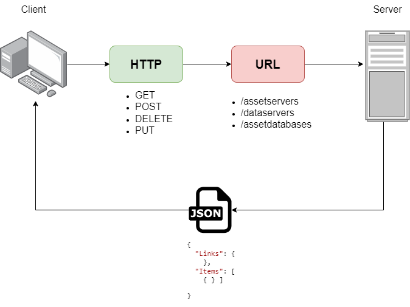
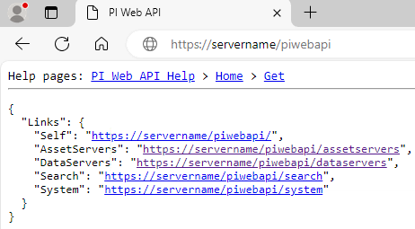

<style>
/* Centraliza o título do primeiro slide */
section:first-of-type h1 {
  text-align: left; /* Alinha o título à esquerda */
}

section {
  font-family: 'Verdana', sans-serif;
  background-color: #ffffff; /* Fundo branco */
  color: #333;
  position: relative;
}

h1, h2, h3 {
  font-family: 'Verdana', sans-serif;
  color: #049A9A;
  margin: 0;
}

h1 {
  font-size: 2.5em;
  margin-bottom: 0.5em;
}

h2 {
  font-size: 2em;
  margin-bottom: 0.5em;
}

h3 {
  font-size: 1.75em;
  margin-bottom: 0.5em;
}

ul {
  font-size: 1.25em;
  line-height: 1.5;
}

code {
  font-size: 1em;
  background-color: #eef;
  padding: 0.2em 0.4em;
  border-radius: 5px;
}

pre {
  background-color: #eef;
  padding: 1em;
  border-radius: 10px;
  font-size: 1em;
}

footer {
  font-size: 0.8em;
  color: #777;
  position: absolute;
  bottom: 1em;
  width: 100%;
  text-align: center;
}

img.linkedIn-img {
  width: 50px;
  height: 50px;
  position: absolute;
  bottom: 10px;
  right: 100px;
  margin-left: 10px;
}

img.github-img {
  width: 50px;
  height: 50px;
  position: absolute;
  bottom: 10px;
  right: 10px;
  margin-left: 10px;
}

img.vision-img {
  width: 150px;
  height: 150px;
  position: absolute;
  top: 10px;
  left: 10px;
  margin-left: 10px;
}

img.search-img {
  width: 680px;
  height: 680px;
  position: absolute;
  top: 10px;
  right: 50px;
  margin-left: 10px;
}

.content {  
  margin-top: -500px;
  z-index: 1;
}

.slide-title {
  text-align: center;
  margin-top: 0px;  /* Ajuste o valor para ajustar a posição do título */
  margin-bottom: auto;
  font-size: 1.75rem;  /* Ajuste o valor para alterar o tamanho do título */
}

.template-img {
  max-width: auto;
  height: auto;
  margin-top: 0px;  /* Ajuste o valor para mover a imagem para cima */
  margin-bottom: 70px;  /* Ajuste o valor para aumentar o espaço abaixo da imagem */
}

.no_template-img {
  max-width: auto;
  height: auto;
  margin-top: 0px;  /* Ajuste o valor para mover a imagem para cima */
  margin-bottom: 70px;  /* Ajuste o valor para aumentar o espaço abaixo da imagem */
}
.reduced-img {
  
  margin-left: 100px;
  max-width: 800px;
  height: 600px;
}

/* Marca d'água */
.watermark {
  position: absolute;
  top: 50%;
  left: 50%;
  transform: translate(-50%, -50%) rotate(-45deg);
  font-size: 3em;
  color: rgba(128, 0, 128, 0.2);
  opacity: 0.5;
  z-index: 1;
  pointer-events: none;
}
</style>

<div class="watermark">kaikecastro</div>

# Accessing the <span style="color: blue">PI Web API</span> with Python

<a href="https://github.com/kaikecc"></a>
<a href="https://www.linkedin.com/in/kaikecastro/"></a>

<a href="https://docs.aveva.com/"></a>

---

<div class="watermark">kaikecastro</div>

## Introduction

* [**PI Web API**](https://docs.aveva.com/bundle/pi-web-api-reference/page/help.html) is a powerful tool for interacting with PI System programmatically.
* **Python** is a versatile language widely used for automation and data analysis.

This presentation will guide you on how to access and manipulate data using the PI Web API with Python. This process can be useful for integrating PI data with other systems and automating tasks.

<a href="https://github.com/kaikecc"></a>
<a href="https://www.linkedin.com/in/kaikecastro/"></a>

---
<div class="watermark">kaikecastro</div>
<h1 class="slide-title">PI Web API</h1>

<!-- Conteúdo -->
<div class="content" style="display: flex; align-items: flex-start; position: relative; top: 75px; font-size: 0.8em;">
  <div style="flex: 1; text-align: left; max-width: 50%;">
    <ul>
      <li>The PI Web API is a RESTful interface for accessing PI System data (AF & DA) over HTTPS.</li><br>
      <li>It enables read and write access for client applications, fostering custom integrations.</li><br>
      <li>The API offers a modern, flexible approach to leverage your data for analytics, visualizations, and more.</li>
    </ul>
  </div> 
  <div style="flex: 1; text-align: right;">
    <a href="/"></a>
  </div>
</div>

---
<div class="watermark">kaikecastro</div>
<h1 class="slide-title">Home Web API</h1>

<div style="display: flex; justify-content: center; align-items: center; height: 100%;">
  
</div>

---


<div class="watermark">kaikecastro</div>

## Why Use the PI Web API?

* **Automate Data Retrieval:** Fetch and process PI System data programmatically.
* **Data Integration:** Integrate PI data with other applications and systems.
* **Custom Dashboards:** Build custom dashboards based on your specific needs.
* **Scheduled Tasks:** Run automated tasks like data extraction and analysis at regular intervals.

<a href="https://github.com/kaikecc"></a>
<a href="https://www.linkedin.com/in/kaikecastro/"></a>

---
<div class="watermark">kaikecastro</div>

## Key Principles of PI Web API

<ul style="font-size: 0.9em;">
  <li><strong>Stateless:</strong> Each request is independent, simplifying client development.</li>
  <li><strong>Resource-oriented:</strong> Interaction revolves around resources representing PI System objects (elements, attributes, points).</li>
  <li><strong>Navigable:</strong> Links connect resources, enabling seamless navigation and discovery.</li>
  <li><strong>Uses HTTP Verbs:</strong> GET, POST, PUT, PATCH, DELETE for standard CRUD operations.</li>
  <li><strong>JSON Format:</strong> Data exchanged in easy-to-parse JSON, compatible with various programming languages.</li>
</ul>

---

<div class="watermark">kaikecastro</div>

## Getting Started

**Prerequisites:**

* **PI System Access:** Ensure you have access to a PI System with the PI Web API enabled.
* **Python Installation:** Have Python installed on your system.
* **Required Libraries:** Install the `requests` library: `pip install requests`

<a href="https://github.com/kaikecc"></a>
<a href="https://www.linkedin.com/in/kaikecastro/"></a>

---
<div class="watermark">kaikecastro</div>

<h2 style="font-size: 1.5em;">Code Example</h2>

```python
import requests

# Define the PI Web API URL and the endpoint for fetching data
pi_web_api_url = "https://your-pi-server/piwebapi"
data_endpoint = "/elements/{webId}/elements"

# Specify your PI Web API credentials
username = "your_username"
password = "your_password"

# Make the request to fetch data
response = requests.get(
    f"{pi_web_api_url}{data_endpoint}",
    auth=(username, password)
)

# Check if the request was successful
if response.status_code == 200:
    data = response.json()
    print(data)
else:
    print(f"Failed to fetch data. Status code: {response.status_code}")
```